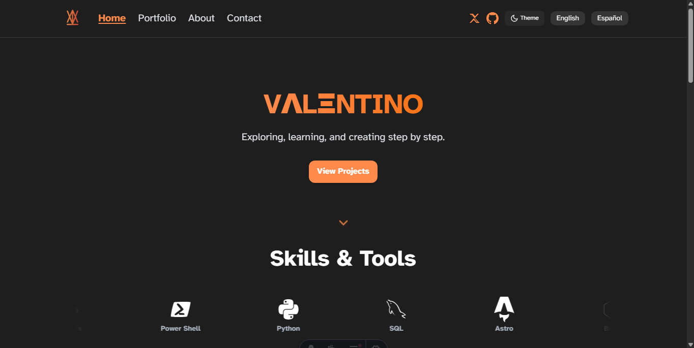
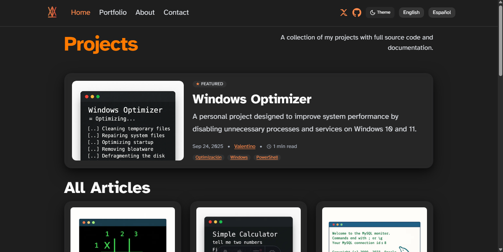

# 🚀 Portfolio — Valentino

[](https://astro.build)
[](https://tailwindcss.com)
[](https://www.typescriptlang.org/)
[](https://<tu-url>.vercel.app)
[](#-licencia)

Portafolio personal construido con **Astro + Tailwind**. Reúne mis proyectos, bitácoras y experimentos.

---

## ✨ Preview

> Subí tus capturas a `public/readme/` y usa estas rutas.




---

## 🛠 Stack

- **Astro 4** (Content Collections, Astro Assets)
- **TypeScript 5**
- **Tailwind CSS 4**
- **MDX / Markdown**
- **Vercel** (CI/CD con GitHub)

---

## 🔗 Enlaces rápidos

- 🖥 **Producción:** https://<tu-url>.vercel.app  
- 📁 **Repo:** https://github.com/https-zanxho/Portfolio

---

## 🌟 Proyectos destacados

> Actualizá los slugs y descripciones. Los links van a tu sitio en Vercel.

| Proyecto                 | Stack                    | Live |
|--------------------------|--------------------------|------|
| **Windows Optimizer**    | PowerShell · UI/CLI      | https://<tu-url>.vercel.app/projects/windows-optimizer/ |
| **Simple Calculator**    | JS · CLI                 | https://<tu-url>.vercel.app/projects/calculator/ |
| **MySQL CLI**            | Node · MySQL             | https://<tu-url>.vercel.app/projects/mysql-cli/ |

---

## ▶️ Correr en local

```bash
git clone https://github.com/https-zanxho/Portfolio.git
cd Portfolio
npm install
npm run dev
```
---

## Sobre mí

Soy Valentino, desarrollador en constante aprendizaje, apasionado por:

- Software y automatización

- Seguridad informática

- Optimización de sistemas

- UX & diseño minimalista

---

## Contacto

Email: <valentinonunez133@gmail.com>

GitHub: https://github.com/https-zanxho

Si te interesa colaborar o tienes alguna sugerencia, ¡estoy encantado de escucharte!

“Basado en plantilla *free-astro-template by guihubie*, adaptado y ampliado por Valentino”